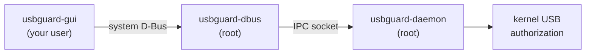

<!--
Copyright (c) 2026 onyks-os
SPDX-License-Identifier: MIT
-->

<h1 align="center">
  <picture>
    <source media="(prefers-color-scheme: dark)" srcset="assets/logo-dark.svg">
    
  </picture>
</h1>

<h4 align="center">A desktop interface for <a href="https://usbguard.github.io/">USBGuard</a>: see which USB devices are connected, <b>allow or block them</b>, and edit the policy — without root.</h4>

<p align="center">
  <a href="https://github.com/sponsors/onyks-os"></a>
  
  
  
  <a href="https://github.com/onyks-os/USBGuardGUI/actions/workflows/ci.yml"></a>
  <a href="https://onyks-os.github.io/usbguard-gui/"></a>
  <!-- <a href="https://scorecard.dev/viewer/?uri=github.com/onyks-os/USBGuardGUI"></a> -->
  
</p>

<p align="center">
  <a href="#features">Features</a> •
  <a href="#requirements">Requirements</a> •
  <a href="#installation">Installation</a> •
  <a href="#usage">Usage</a> •
  <a href="#how-it-works">How It Works</a> •
  <a href="#verification">Verification</a> •
  <a href="#contributing">Contribute</a>
</p>

---

Plug in a device, see it appear as **blocked**, allow it for this session with one click — and when
something does not work, be told *exactly* which layer refused and what to run to fix it.

> [!NOTE]
> USBGuardGUI is a front end. The protection comes from the **USBGuard daemon**, which decides what
> the kernel lets through; this program only asks it, with your authorization, to change its mind.
> If USBGuard is not installed and running, there is nothing for this program to protect you with.

## Why USBGuardGUI?

USBGuard's own interface is the `usbguard` command, which is complete but leaves the hard part to
you: a command that fails may have been stopped by the D-Bus bus policy, by Polkit, or by the
daemon's own access control, the error text rarely says which, and the fix is different in each
case.

| | |
| :--- | :--- |
| **No privileges of its own** | No setuid bit, no helper daemon, no privileged code path. Every change is made by the USBGuard daemon on its own authority, after Polkit has asked *you* for a password. |
| **Failures are diagnosed, not reported** | Eight distinct failure states — bridge not installed, bridge stopped, refused by the bus policy, by Polkit, by the daemon's access control, no Polkit agent, and more — each with its specific remedy and the exact command for your distribution. |
| **Safe by default** | Every device action asks: *this session only*, or *permanently*? The preselection is the one whose effect disappears when USBGuard restarts. Reject asks for confirmation. |
| **Rules removed by identity, not by number** | USBGuard rule numbers shift whenever the ruleset changes. A rule is identified by its text and re-resolved just before removal, so a rule deleted from another terminal is reported as gone instead of a *different* rule being removed. |
| **Hostile device names are just text** | Device names and serial numbers come from the device itself. The rule parser treats them as untrusted bytes, is fuzzed, and escapes them on the way back, so a crafted name cannot become rule syntax. |

## Features

* **Live device list** — authorization state with icon *and* text, name, `vendor:product`, serial,
  and port, sorted by physical topology. Insertion bursts are merged, so a hub full of devices does
  not freeze the window.
* **Device actions** — allow, block, reject; this session only or permanently; a Cancel button while
  a password prompt is open, which never times out on its own.
* **Policy view** — the ruleset in the order the daemon evaluates it, a rule editor with a guided
  mode and a text mode, live preview and validation before anything is sent, and explicit placement
  ("at the end" or "after rule N").
* **Runtime parameters** — `ImplicitPolicyTarget` and `InsertedDevicePolicy`, changed with
  confirmation.
* **Notifications** — when a device that is not authorized is plugged in, with an *Allow for this
  session* button where the notification server supports it.
* **Background mode** — keeps announcing new devices after the window is closed, with a status icon
  where the desktop has one, and an optional start at login.
* **`usbguard-gui --diagnose`** — the whole access check as one command whose output you can paste
  into a bug report.

## Requirements

* **Linux** with a graphical session (Wayland or X11) and a Polkit authentication agent — every
  desktop environment ships one.
* **USBGuard 1.1.0 or later**, running, with its **D-Bus bridge**:
  * Debian, Ubuntu, Arch: included in the `usbguard` package;
  * Fedora, RHEL: the separate `usbguard-dbus` package.
* **GTK 4.14+** and **libadwaita 1.5+** (Ubuntu 24.04, Debian 13, Fedora 40, and current Arch, or
  later).
* **No root.** Run it as your normal user.

## Installation

### 1. Native packages (recommended)

Download the package for your distribution from the
[latest release](https://github.com/onyks-os/USBGuardGUI/releases/latest) and install it:

* **Debian / Ubuntu**: `sudo apt install ./usbguard-gui_0.1.0-1_amd64.deb`
* **Fedora / RHEL**: `sudo dnf install ./usbguard-gui-0.1.0-1.x86_64.rpm`
* **Arch Linux**: from a clone, `cd packaging/arch && makepkg -si`

The packages pull in USBGuard and its bridge, and change no system configuration: no post-install
script runs, and the example Polkit rule is installed as documentation, never activated.

On a fresh USBGuard installation, make sure the services are running. Debian and Ubuntu enable them
on install; elsewhere, enable them yourself — but first give the daemon a policy:

> [!CAUTION]
> USBGuard started with an empty policy **blocks every USB device, including your keyboard and
> mouse**. Generate a policy that allows what is connected right now before starting it:
>
> ```bash
> sudo sh -c 'umask 077; usbguard generate-policy > /etc/usbguard/rules.conf'
> sudo systemctl enable --now usbguard.service usbguard-dbus.service
> ```

For verifying release assets, see the [Release Verification Guide](docs/verification.md).

### 2. From source

```bash
# Build dependencies
sudo dnf install gtk4-devel libadwaita-devel gcc                    # Fedora
sudo apt install libgtk-4-dev libadwaita-1-dev build-essential       # Debian / Ubuntu
sudo pacman -S gtk4 libadwaita base-devel                            # Arch

git clone https://github.com/onyks-os/USBGuardGUI.git
cd USBGuardGUI
cargo run --release
```

`make package-deb` and `make package-rpm` build the packages above from the tree.

## Usage

Open **USBGuard** from your application menu, or run `usbguard-gui`. Every option, setting, and exit
code is listed in the [External Interfaces Reference](docs/interfaces.md).

* **Check that everything is in place** (daemon, bridge, permissions):

  ```bash
  usbguard-gui --diagnose
  ```

* **Print the device list or the ruleset** without opening a window:

  ```bash
  usbguard-gui --list-devices
  usbguard-gui --list-rules
  ```

If `--diagnose` reports anything but `connected`, it names the cause and the command that fixes it.

<details>
<summary>Changing policy without typing the administrator password every time</summary>

By default USBGuard lets any active local user *read* devices and rules, and asks for the
administrator password for every *change*. An administrator who wants members of the admin group to
confirm changes with their **own** password instead can install the example rule shipped with the
package — after reading it:

```bash
sudo install -m 0644 /usr/share/doc/usbguard-gui/70-usbguard-gui.rules.example \
     /etc/polkit-1/rules.d/70-usbguard-gui.rules
```

This is deliberately not done by the package: widening who may change USB policy is the
administrator's decision.

</details>

## How It Works



1. **One path to the daemon**: the program talks only to the USBGuard D-Bus bridge on the system
   bus. On the way, a request passes the bus policy, then Polkit (which may ask for a password), then
   the daemon's own access control — and a refusal at each is told apart.
2. **Two loops that never share state**: a Tokio runtime owns every D-Bus call; the GTK main loop
   owns every widget. They exchange immutable events over one channel, so the compiler — not code
   review — keeps them apart.
3. **Bursts are merged, not delayed**: device signals are coalesced by device within a fixed latency
   ceiling; above forty devices in flight, one fresh device list replaces the deltas.
4. **Nothing stale survives a reconnection**: when the bridge disappears the list is greyed out;
   when it returns, everything is re-read.
5. **Writes are requests**: the view changes when the daemon reports the change, never before.

For the complete design — the upstream contract, the access model, concurrency, and the failure
analysis — see the **[Technical Architecture & Design Guide](docs/architecture.md)**.

## Known Behavior & Limitations

> [!WARNING]
>
> * **Cancel stops waiting, not the daemon.** Cancelling an operation while the password prompt is
>   open stops the program from waiting; if the daemon had already acted, the list shows what it
>   actually did.
> * **Removing a rule has a tiny unavoidable race.** The rule is re-resolved by its text just before
>   removal; closing the window completely needs a USBGuard API change.
> * **No status icon on stock GNOME.** GNOME shows tray icons only with the AppIndicator extension.
>   Without it, background mode still announces devices, and launching the application again
>   reopens the window.
> * **Configuration files are never edited.** `usbguard-daemon.conf`, `rules.conf`, and the IPC
>   access-control files are root-only; the program diagnoses them and tells you what to run. The
>   program's own code reads and writes nothing under `/etc`, `/var`, or `/sys` (the system libraries
>   it uses, such as GTK, still read their own configuration).

The full list of residual risks and the threat model are in
[`docs/security-assessment.md`](docs/security-assessment.md).

## Verification

What the program assumes about USBGuard was **observed, not taken from the documentation** — and
three of those assumptions turned out to be wrong in the documentation:

* **Against a real daemon** (usbguard 1.1.4): the D-Bus interfaces were introspected, the signal and
  target numbers recorded while a real device was plugged in, blocked, allowed, rejected, and
  removed, and the identity USBGuard's access control checks was tested directly. Results and the
  introspection data are in [`docs/architecture.md`](docs/architecture.md) §13.4 and
  [`docs/dbus-introspection/`](docs/dbus-introspection/).
* **Across distributions**: how Debian, Ubuntu, Arch, and Fedora package USBGuard was checked in
  clean containers, and the `.deb` and `.rpm` were installed and run in clean Debian, Ubuntu, and
  Fedora containers.
* **The rule parser** handles text that ultimately comes from the USB device itself. It is
  property-tested (render → parse is the identity, and no device name can become syntax) and was
  fuzzed with 10⁶ inputs per target without a finding; CI fuzzes it on every pull request.
* **Failure scenarios** — a 40-device burst, a bridge restart, a rule removed from another terminal,
  identical rules, hostile device names — run against a mock USBGuard bridge on a private D-Bus
  connection, never against your system's daemon.

```bash
make verify        # formatting, lints (warnings are errors), all tests, dependency audit
make fuzz-parser   # cargo-fuzz the parser (nightly toolchain + cargo-fuzz)
```

## Development & Testing

> [!IMPORTANT]
> **Always run `make verify` before pushing code.** If it fails, the change is not ready.

| Command | Goal |
| :------ | :--- |
| `make test` | Unit and integration tests (no privileges, no daemon needed). |
| `make lint` | rustfmt, Clippy with warnings as errors, ShellCheck, markdownlint. |
| `make verify` | Lint + tests + dependency audit — the pre-push gate. |
| `make fuzz-parser` | Fuzz the rule parser; `FUZZ_RUNS=…` sets the count. |
| `make package-deb` / `make package-rpm` | Build native packages into `dist/`. |
| `make help` | Every available target. |

`cargo build --no-default-features` builds the headless commands without GTK.

## Project Structure

```text
├── src/
│   ├── model/        # Domain types — depend on nothing else in the program
│   ├── rules/        # Rule-language lexer, parser, renderer, and guided builder
│   ├── dbus/         # Proxies, client, event worker, supervisor, diagnostics
│   ├── ui/           # GTK 4 / libadwaita interface (Cargo feature `gui`)
│   └── cli.rs        # --diagnose, --list-devices, --list-rules
├── tests/            # Property tests, and D-Bus tests against a mock bridge
├── fuzz/             # cargo-fuzz targets for the parser
├── data/             # Desktop file, AppStream metainfo, GSettings schema, icons
├── packaging/        # Arch PKGBUILD, Flatpak manifest, example Polkit rule
├── assets/           # Logo
└── docs/             # Architecture, interfaces, threat model, Phase 0 results
```

## Contributing

Contributions are welcome. The areas where help matters most:

1. **USBGuard on other distributions** — behaviour of the D-Bus bridge and its Polkit defaults on
   systems other than the ones already checked.
2. **GTK 4 / libadwaita** — accessibility, keyboard navigation, and adaptive layouts.
3. **Packaging** — Flathub submission, and distribution packages.

Start with [CONTRIBUTING.md](CONTRIBUTING.md). Every commit needs a DCO `Signed-off-by` line.

| | |
| :--- | :--- |
| Bugs and feature requests | [GitHub Issues](https://github.com/onyks-os/USBGuardGUI/issues) |
| Security vulnerabilities | [SECURITY.md](SECURITY.md) — please do not open a public issue |
| Version support and EOL | [SUPPORT.md](SUPPORT.md) |
| Releases and packages | [GitHub Releases](https://github.com/onyks-os/USBGuardGUI/releases) |

This project is maintained in free time. A [star](https://github.com/onyks-os/USBGuardGUI) helps
others find it; [sponsorship](https://github.com/sponsors/onyks-os) helps it keep going.

## License

MIT. See [LICENSE](LICENSE) for more information.
