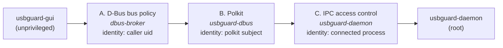

<!--
Copyright (c) 2026 onyks-os
SPDX-License-Identifier: MIT
-->

<h1 align="center">
  USBGuardGUI - USBGuard GUI
</h1>

<h4 align="center">Unprivileged GTK4 desktop client for managing USB device authorization policy through the USBGuard daemon.</h4>

<p align="center">
  <a href="https://github.com/sponsors/onyks-os"></a>
  
  
  <a href="https://github.com/onyks-os/USBGuardGUI/actions/workflows/ci.yml"></a>
  <a href="https://onyks-os.github.io/usbguard-gui/"></a>
  <a href="https://www.bestpractices.dev/projects/0"></a>
  <a href="https://scorecard.dev/viewer/?uri=github.com/onyks-os/USBGuardGUI"></a>
  
</p>

<p align="center">
  <a href="#features">Features</a> •
  <a href="#requirements">Requirements</a> •
  <a href="#installation">Installation</a> •
  <a href="#usage">Usage</a> •
  <a href="#how-it-works">How It Works</a> •
  <a href="#obtain-feedback--contributions">Contribute</a>
</p>

---

> [!IMPORTANT]
> **Pre-implementation.** The architecture is specified in full
> ([`docs/architecture.md`](docs/architecture.md)) and the repository is set up, but no release
> exists yet and the features below describe the target, not shipped behaviour. Track progress in
> [`ROADMAP.md`](ROADMAP.md).

---

## Why USBGuardGUI?

USBGuard enforces a USB authorization policy in a root daemon, and the only interface its users
normally have to it is the `usbguard` command-line tool. That tool is complete, but it puts the
entire burden of the *access model* on the person typing: a command that fails can have been
stopped by the D-Bus bus policy, by Polkit, or by the daemon's own IPC access-control list, and the
error text rarely says which. The remedy is different in each case.

USBGuardGUI is a desktop client for the same daemon that treats that distinction as its central
problem rather than an edge case. It does not reimplement the CLI — operations with no D-Bus
equivalent (`generate-policy`, `add-user`, `read-descriptor`) stay where they are.

Key architectural advantages:

* **Unprivileged by construction**: no setuid bit, no helper daemon, no privileged code path, and
  no read or write of any file under `/etc`, `/var`, or `/sys`. Every privileged effect is produced
  by the USBGuard daemon on its own authority, after the system's own authorization layers have
  approved the request. The property is enforceable, not just claimed: `strace` filtered on those
  three prefixes must report zero accesses.
* **Failure is diagnosed, not reported**: a dedicated component with its own state type and probe
  sequence distinguishes nine reasons communication can fail — bridge package missing, bridge
  service stopped, denied by bus policy, denied by Polkit, denied by the IPC ACL, no Polkit agent
  in the session, and so on — and states the specific remedy for each.
* **Rule identity that survives concurrency**: USBGuard rule IDs are positional and shift whenever
  the ruleset changes. Rules are therefore held by canonical text rather than by ID and re-read
  immediately before use, so a rule removed from another terminal reports `AlreadyGone` instead of
  silently removing a different rule.

## Features

* **Device view**: the devices known to the daemon with their authorization state, updated live
  from daemon signals. Insertion bursts are coalesced within a bounded latency window rather than
  redrawn per event, so a 40-port hub does not freeze the interface.
* **Policy view**: the active ruleset in evaluation order, with appending and removal that account
  for rule-ID volatility.
* **Device actions**: allow, block, and reject, each with an explicit choice between a runtime-only
  effect and a persisted rule. The preselection defaults to runtime-only — for a security tool, the
  less destructive default is the one whose effect disappears on restart.
* **Runtime parameters**: reads `ImplicitPolicyTarget` and `InsertedDevicePolicy`, and modifies them
  where the access model permits it.
* **Access diagnostics**: a probe sequence run after the window is presented, never during startup,
  so that any Polkit prompt it causes is attributable to a window the user can see. Also available
  headless as `usbguard-gui --diagnose`.
* **Notifications**: desktop notifications for newly inserted, not-yet-authorized devices, with
  quick actions where the notification server supports them.
* **Background mode and tray**: a `StatusNotifierItem` status icon where the desktop provides a
  watcher, degrading explicitly and visibly — never silently — where it does not.

## Requirements

* **Rust 1.85+** (2024 edition) — to build.
* **USBGuard daemon 1.1.0 or later** — earlier versions have a different `appendRule` arity.
* **The USBGuard D-Bus bridge** (`usbguard-dbus`). Debian, Ubuntu, and Arch ship it inside the
  `usbguard` package; Fedora ships it separately as `usbguard-dbus`. Without it the program cannot
  function at all; its absence is a distinct diagnostic state with a per-distribution install
  command.
* **GTK 4.14+** and **libadwaita 1.5+**.
* A Wayland or X11 session, and a running Polkit session agent.
* **No root.** The program is an unprivileged client and must not be run as one.

Reference distributions for verification: Fedora, Debian stable, Ubuntu LTS, Arch.

## Installation

> No release exists yet. The paths below are the supported install routes once one does.

**From source** (the only route available today):

```bash
git clone https://github.com/onyks-os/USBGuardGUI.git
cd USBGuardGUI
make setup
```

Build-time system dependencies:

```bash
# Fedora / RHEL
sudo dnf install gtk4-devel libadwaita-devel glib2-devel pkgconf-pkg-config gcc
# Debian / Ubuntu (Ubuntu 24.04 or later, for GTK 4.14 and libadwaita 1.5)
sudo apt install libgtk-4-dev libadwaita-1-dev pkg-config build-essential
# Arch
sudo pacman -S gtk4 libadwaita pkgconf base-devel
```

Then `cargo run` opens the window, and `cargo run -- --diagnose` runs the access checks. To build
without GTK at all — the headless commands only — use `cargo build --no-default-features`.

**Packages from source** (no release is published yet):

```bash
make package-deb     # Debian / Ubuntu → dist/*.deb   (needs: cargo install cargo-deb)
make package-rpm     # Fedora / RHEL   → dist/*.rpm   (needs: cargo install cargo-generate-rpm)
cd packaging/arch && makepkg -si   # Arch
```

Build the `.deb` on Debian or Ubuntu itself: a binary built on a newer distribution needs a newer
glibc than theirs. The `.rpm` depends on `usbguard-dbus`, which Fedora packages separately; the
`.deb` and the Arch package depend on `usbguard`, which includes the bridge there. No package
modifies system configuration on install. A Flatpak manifest is in `packaging/`; Flathub
submission is planned.

For instructions on verifying the integrity and authenticity of release assets, see the
[Release Verification Guide](docs/verification.md).

## Usage

For the complete list of commands, options, exit codes, and technical specifications, see the
[External Interfaces Reference](docs/interfaces.md).

### Quick Start

```bash
# Check that the daemon, the bridge, and your permissions are actually in place.
usbguard-gui --diagnose

# Open the window.
usbguard-gui
```

If `--diagnose` reports anything other than `Ok`, it names the remedy. Paste its output into a bug
report instead of describing a dialog.

## How It Works

An unprivileged process asking a root daemon to change USB authorization passes through three
independent checkpoints, each enforced by a different component, each evaluating a possibly
different identity, and each closed by default in a stock configuration.



1. The program connects to the **system D-Bus bus** and probes for the bridge name `org.usbguard1`,
   distinguishing "package not installed" from "service not running" without touching the
   filesystem.
2. It reads devices and rules through the bridge's typed proxies, and subscribes to the daemon's
   signals.
3. A **Tokio runtime** owns every D-Bus interaction; the **GLib main loop** owns every widget. The
   two never share state — they exchange immutable `UiEvent` values over an executor-agnostic
   channel, with an event worker that coalesces insertion bursts under a fixed latency ceiling.
4. A **supervisor** reconnects with backoff when the bridge disappears, and invalidates the cache
   on return rather than trusting stale state.
5. Every write is a request, never an assumption: nothing is optimistically applied to the view
   before the daemon has confirmed it.

For a detailed walkthrough of the execution flows, trust boundaries, and modular components, see the:

**[Technical Architecture & Design Guide](docs/architecture.md)**

## Known Behavior & Limitations

> [!WARNING]
> The limitations below are design consequences, not defects. Each one is stated because a security
> tool that hides its edges is worse than one that names them.

* **The bridge is optional packaging everywhere.** A large share of first-run failures will be
  "bridge not installed". That is a packaging fact about USBGuard, not a bug here.
* **`usbguard-daemon.conf` and the IPC access-control files are never edited.** Both are
  root-owned `0600` files; editing them would require privilege escalation and contradict the
  design. The program diagnoses the configuration and tells you exactly what to run.
* **The Polkit rule is shipped as an example, not installed.** Granting an unprivileged user the
  right to change USB policy is the administrator's decision, not the package's.
* **Offline editing of `rules.conf` is not supported.** The file is unreadable to an unprivileged
  user, and writing it behind the daemon's back desynchronizes its in-memory ruleset from disk.
* **Removing a rule has an irreducible client-side race.** It is narrowed by re-reading
  immediately before removal; closing it entirely needs an upstream API change.
* **Denial attribution reads daemon error strings**, which is the only hook the API offers and
  must be recalibrated per USBGuard version. When attribution fails, both remedies are shown
  rather than a guess.

For a full breakdown of residual risks and the STRIDE threat model, see
[`docs/security-assessment.md`](docs/security-assessment.md).

## Development & Testing

USBGuardGUI uses a **Makefile** to standardize the development pipeline.

> [!IMPORTANT]
> **Always run `make verify` before pushing code.** If it fails, the change is not ready.

| Command        | Goal                                                             |
| :------------- | :--------------------------------------------------------------- |
| `make setup`   | Bootstrap the development environment.                            |
| `make test`    | Run the unit test suite (fast, no privileges required).           |
| `make lint`    | Run linters, formatters (check mode), and static analysis.        |
| `make verify`  | Full local gate: lint + tests + dependency audit.                 |
| `make docs`    | Build the MkDocs documentation site.                              |
| `make build`   | Produce distributable artifacts.                                  |
| `make todo`    | List the documentation sections still to be filled in.            |
| `make help`    | Show every available target.                                      |

The D-Bus-dependent tests run against a mock implementation of the three interfaces on a private
bus, never against a live system daemon.

## Project Structure

```text
├── Makefile                # Developer entrypoint (see make/)
├── make/                   # Modular Makefile fragments
├── docs/                   # Technical documentation, ADRs, and the MkDocs site source
├── scripts/                # Installation, verification, and maintenance scripts
├── tests/                  # Test suites
├── data/                   # Desktop file, AppStream metainfo, GSettings schema, icons, UI templates
├── packaging/              # The example Polkit rule (shipped inert); package manifests later
├── fuzz/                   # cargo-fuzz targets for the rule parser
└── src/                    # Main source package
    ├── model/              # Domain types — depends on nothing else in the program
    ├── rules/              # Rule-language lexer, parser, and renderer
    ├── dbus/               # Proxies, client, event worker, supervisor, diagnostics
    ├── device_store.rs     # The device table as pure data: snapshots, batches, ordering
    ├── remedy.rs           # Per-distribution remedies for each access state
    ├── cli.rs              # Headless commands: --diagnose, --list-devices, --list-rules
    └── ui/                 # Window shell and views (Cargo feature `gui`)
```

The dependency direction is strictly one way: `model` depends on nothing; `rules` depends on
`model`; `dbus` depends on `model` and `rules`; `ui` depends on all three. `model` and `rules` are
testable without a bus and without a display, which is what makes the majority of the test suite
runnable in CI.

## Obtain, Feedback & Contributions

* **Obtain**: releases are published on the [GitHub Releases](https://github.com/onyks-os/USBGuardGUI/releases) page.
* **Feedback**: report bugs or request features on the [GitHub Issues](https://github.com/onyks-os/USBGuardGUI/issues) tracker.
* **Contribute**: read the [Contributing Guidelines](CONTRIBUTING.md) before submitting code.
* **Security**: review the [Security Policy](SECURITY.md) before reporting any vulnerability.

## Support

For version support status, EOL information, and support channels, see the [Support Policy](SUPPORT.md).

<div align="center">

If you find **USBGuardGUI** useful, please consider giving it a **Star**!

[](https://github.com/onyks-os/USBGuardGUI)

</div>

## License

MIT. See [LICENSE](LICENSE) for more information.
