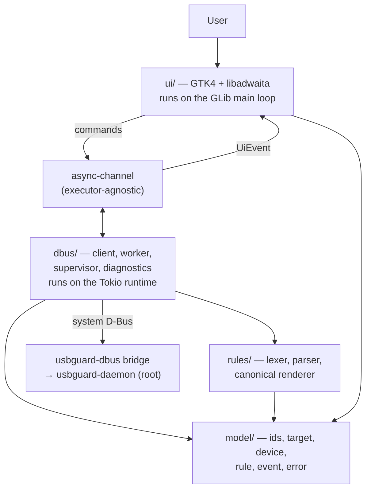

# Explanation: System Architecture

This page explains **why** USBGuardGUI is built the way it is. For the exhaustive internal
reference, see [`docs/architecture.md`](https://github.com/onyks-os/USBGuardGUI/blob/main/docs/architecture.md)
in the repository; for the decision history, see the
[ADRs](https://github.com/onyks-os/USBGuardGUI/tree/main/docs/decisions).

---

## 1. System Layer Diagram



The program is four layers with a strictly one-way dependency direction: `model` depends on nothing
else in the program, `rules` depends on `model`, `dbus` depends on `model` and `rules`, and `ui`
depends on all three. Nothing ever points back up.

That constraint is not tidiness for its own sake. `model` and `rules` together hold the rule-language
grammar and every domain type, and because neither can reach a D-Bus connection or a widget, both
are testable in a process with no bus and no display. That is what makes the majority of the test
suite runnable in ordinary CI, which in turn is what makes fuzzing the parser on every pull request
affordable.

The two arrows between `ui` and `dbus` do not share memory. They are a channel, and what crosses it
is immutable values.

## 2. Design Principles

Five constraints shaped everything else. Each one rules something out.

**The program holds no privilege, ever.** No setuid bit, no file capabilities, no helper daemon, and
no read or write by the program's own code of any path under `/etc`, `/var`, or `/sys` (the system
libraries it uses, such as GTK, still read their own configuration). Every privileged effect is produced by
the USBGuard daemon on its own authority. This rules out the obvious conveniences: the program
cannot edit `usbguard-daemon.conf`, cannot install a Polkit rule, and cannot fix a misconfigured IPC
access-control file. It diagnoses each of those and prints the command an administrator would run.

**Two event loops, no shared state.** GTK's main loop is single-threaded and owns every widget;
async D-Bus work needs a real executor. Rather than pretend one can host the other, the program runs
both and lets them communicate only by sending immutable values over an executor-agnostic channel. A
Clippy `disallowed-methods` lint enforces the boundary, and CI runs with `-D warnings`, so crossing
it fails the build rather than producing a race that appears once a month on a fast machine.

**Failure is a taxonomy, not a boolean.** There are at least seven distinct reasons this program can
fail to reach the daemon, and the remedy differs for each: install a package, start a unit, install
a Polkit rule, edit an IPC ACL, start a session agent. A single red indicator would force every user
to rediscover that taxonomy themselves. Diagnostics is therefore a first-class component with its
own state type and its own probe sequence, not a status dot.

**Nothing is optimistic.** The view changes on a daemon signal or a confirmed reply, never in
anticipation of one. This rules out the snappier interaction where a row updates the instant it is
clicked. A view that disagrees with the daemon invites the user to make a security decision on false
information, and there is no interface-responsiveness argument that outweighs that.

**When the truth is unknown, refuse and say which.** A rule whose text no longer matches, an
operation interrupted by a daemon restart, a denial that cannot be attributed to a checkpoint — in
each case the program reports what it does not know rather than picking the likely answer. The cost
is occasional friction; the alternative is removing the wrong rule.

## 3. Execution Flow

**Startup.** Parse arguments, set up the `AdwApplication`, start the Tokio runtime alongside the
GLib main loop, and present the window. Note the order: the window is presented *before* any probe
runs, so that a Polkit prompt caused by a probe belongs to a window the user can already see. A
prompt that appears during startup, attached to nothing, is one the user has no way to evaluate.

**Diagnosis.** The probe sequence runs in order and stops at the first failure: is there a system
bus; does anything own `org.usbguard1`, or is the name at least *activatable*; is a Polkit agent
present; can a parameter be read; and if not, which checkpoint refused. Probe 2 is what makes
"package not installed" distinguishable from "service not running" without touching the filesystem —
the D-Bus service file that makes a name activatable is installed by the bridge package and by
nothing else. There is deliberately no probe for write access: the only honest test of a write is a
write, and a test write would change the system's USB policy to find out whether it may.

**Steady state.** The worker subscribes to the daemon's signals and maintains the device and rule
caches. Signals do not update the view one at a time. They enter a coalescing window with a fixed
latency ceiling, and what emerges is a single batched `UiEvent` — which is why inserting a 40-port
hub produces one redraw rather than forty, and why the burst latency target is a ceiling rather than
an average.

**An action.** The user chooses allow, block, or reject, and — separately and explicitly — whether
the effect is runtime-only or persisted. The runtime-only option is preselected, because for a
security tool the less destructive default is the one whose effect disappears on restart. The
request goes to the daemon and passes three checkpoints outside this program's control. Nothing in
the view changes until the daemon says so.

**What was verified, not assumed.** Before any code depended on it, the D-Bus contract was checked
against a running USBGuard 1.1.4, and three documented assumptions turned out wrong: `listRules`
takes a label filter rather than a query; the bridge emits an undocumented `DevicePolicyApplied`
signal; and only Fedora packages the bridge separately. The first manual test also found that the
bridge asks for a password only when a call carries D-Bus's `ALLOW_INTERACTIVE_AUTHORIZATION` flag.
The full record is in
[§13.4 of the architecture document](https://github.com/onyks-os/USBGuardGUI/blob/main/docs/architecture.md).

**Removing a rule.** This is the subtle one. USBGuard rule IDs are positional: they shift whenever
the ruleset changes, so an ID captured a second ago may now name a different rule. The program
therefore holds rules by their canonical text, re-reads the ruleset immediately before removing, and
re-matches. If the text is gone, it reports that and removes nothing. If the text matches twice — two
textually identical rules — it asks, listing evaluation positions, rather than picking the first.
A race remains, narrowed to a single round-trip; closing it entirely needs an upstream
`removeRuleIfMatches(id, expected_text)`, which is the most valuable contribution this project could
make to USBGuard.

**When the bridge goes away.** The supervisor detects the disconnection, reports it within two
seconds, and reconnects with backoff. On reconnection it invalidates the caches and re-reads rather
than trusting what it held, because the world may have moved while it was not looking. An operation
that was in flight fails with the connection's error and is never retried automatically, because a
retry would act on an assumption the program has just been told is unreliable.

## 4. Trust Boundaries

Summarized here; the full analysis lives in the
[security assessment](https://github.com/onyks-os/USBGuardGUI/blob/main/docs/security-assessment.md).

The program sits on the **low side of every boundary that matters**. It defends none of them; it
crosses them as a supplicant. This is what keeps the threat model small.

```text
[USB device] ──▶ [usbguard-daemon, root] ──▶ [usbguard-dbus] ──▶ [usbguard-gui, unprivileged user]
```

**Inbound — everything from the daemon is untrusted input.** Device names, serial numbers, hashes,
and rule text all originate in a USB device's own descriptors, which means they are attacker-chosen
strings by the time this program sees them. They are parsed into domain types at the boundary,
never interpolated into rule syntax except through the canonical quoter, and the parser is fuzzed
with a target of zero panics over a million inputs. A device whose name contains quotes, backslashes,
and invalid UTF-8 must render as a row with partial fields — not a crash, and not a rule that means
something other than it appears to.

**Outbound — the daemon does not trust this program either, and should not.** Three independent
checkpoints stand between a request and its effect: the D-Bus bus policy evaluating the caller's
uid, Polkit evaluating the session subject, and the daemon's own IPC access-control list evaluating
the connected process. All three are closed by default in a stock configuration, and all three are
outside this program's control. "Runs without root" is a statement about this program's privileges;
it is not a promise that any given call will succeed.

**Sideways — the session bus is not a trust boundary at all.** Any process running as the user can
impersonate the notification server or the `StatusNotifierWatcher`. That is true of every desktop
application, and defending it is out of reach here. What is in reach is bounding the consequence:
no notification reply is trusted to identify a device on its own — before acting, the program checks
that the device holding that number is still the one announced — and every privileged effect still
passes Polkit regardless of what asked for it.
